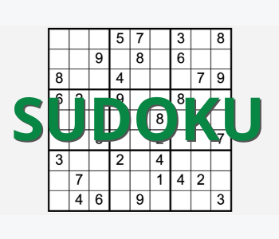

#                                                   	Sudoku Solver


> **Le but de ce projet est de modéliser le remplissage d'une grille de Sudoku sous la forme d'un problème SAT. Ceci permet de remplir toute grille de Sudoku en un temps très court.**

<p align="center">

</p>

## Présentation

Le **Sudoku** est un jeu en forme de grille de taille 9x9 décomposée en 9 carrés de taille 3x3.
Sur chaque cellule, on peut y écrire un chiffre entre 1 et 9.

Une grille de **Sudoku** remplie doit respecter les trois règles suivantes :

- Chaque colonne doit contenir tous les chiffres de 1 à 9
- Chaque ligne doit contenir tous les chiffres de 1 à 9
- Chaque pavé de 3×3 doit contenir tous les chiffres de 1 à 9

<br>

## Modélisation SAT

En ce sens, nous pouvons modéliser le Sudoku en problème SAT. La grille forme une matrice carrée de taille 9 : A = (A<sub>ij</sub>), <sub>i, j ∈ 1..9</sub>.

On associe à chaque cellule A<sub>ij</sub> de la grille 9 variables booléennes. Ceci nous donne en tout 9<sup>3</sup> = 729 variables booléennes. On a :

- ∀ k ∈ 1..9, A<sub>ijk</sub> ne peut prendre que les valeurs *TRUE* ou *FALSE*
- A<sub>ijk</sub> = *TRUE* ⇔  On écrit k sur la grille, sur la colonne i et la ligne j. 
- Par exemple si A<sub>115</sub> = *TRUE*, cela signifie qu'on a placé un 5 tout en haut à gauche de la grille du Sudoku.

Pour garder un certain sens à notre modélisation, on ajoute de nouvelles contraintes (par exemple, on ne peut pas avoir écrit plusieurs chiffres sur une même case)

## Lancer le solver

Le répertoire ``files/`` contient 3 fichiers au format *csv* (comma-separated value) qui correspondent à 3 grilles de Sudoku pré-remplies.

Le script ``run.sh`` transforme la sortie textuelle désordonnée du solver en grille de sudoku.
Il n'attend en argument que le chemin du fichier *csv* de la grille pré-remplie.

````
$ ./run.sh files/le-monde.csv 

 9 1 4  5 8 7  2 3 6
 2 6 7  4 9 3  8 5 1
 3 5 8  1 6 2  7 9 4

 4 3 6  9 7 8  1 2 5
 7 9 1  2 3 5  6 4 8
 5 8 2  6 4 1  9 7 3

 6 7 5  3 1 9  4 8 2
 8 4 3  7 2 6  5 1 9
 1 2 9  8 5 4  3 6 7

$
````

L'affichage est très lisible. On peut voir que la grille respecte les contraintes du Sudoku, donc le problème a bien été modélisé. On peut désormais remplir **toute grille de sudoku existante !** Il suffit d'écrire au format *csv* la grille pré-remplie du Sudoku que l'on cherche à résoudre, et de la donner au solver.

